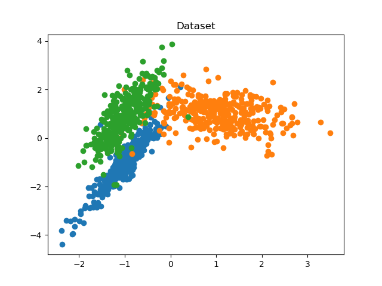

Dominant set + SVM Clustering:
============

Alg 1 in 'Unsupervised Action Discovery and Localization in Videos' [link](http://crcv.ucf.edu/papers/iccv17/Soomro_ICCV17.pdf).

Dominant Set code is from [here](https://github.com/emanuele/dominant_set).

## Results

