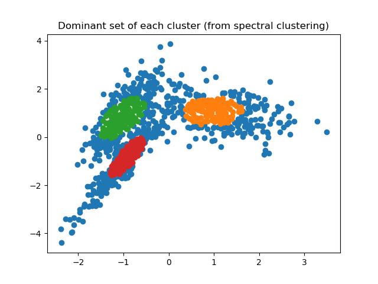

Dominant set + SVM Clustering:
============

Algorithm 1 in:

Soomro, Khurram, and Mubarak Shah. "Unsupervised action discovery and localization in videos." Proceedings of the IEEE Conference on Computer Vision and Pattern Recognition. 2017 [link](http://crcv.ucf.edu/papers/iccv17/Soomro_ICCV17.pdf).

Dominant Set code is from [here](https://github.com/emanuele/dominant_set).

## Results

| |    |
|:-------------------------------------------------:|:---------------------------------------------------------------:|
|      |                |
